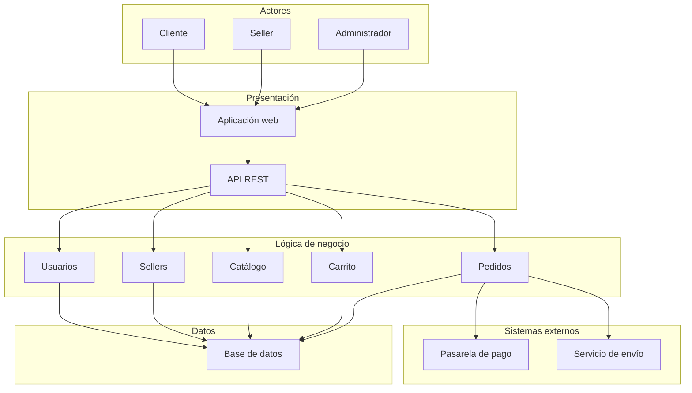

# Arquitectura inicial del sistema

## Organización en tres capas

| Capa | Responsabilidad | Elementos |
|---|---|---|
| Presentación | Recibir las acciones de los usuarios y exponer las funciones del sistema. | Aplicación web y API REST. |
| Lógica de negocio | Aplicar las reglas y coordinar las operaciones del marketplace. | Usuarios, Sellers, Catálogo, Carrito y Pedidos. |
| Datos | Almacenar y consultar la información del sistema. | Base de datos. |

## Diagrama de arquitectura

## Descripción de las relaciones

Los clientes, sellers y administradores interactúan mediante la aplicación web. Esta se comunica con la API REST, que dirige cada solicitud al módulo de negocio correspondiente.

Los módulos de negocio consultan o almacenan información en la base de datos. El módulo de Pedidos se comunica con la pasarela de pago y el servicio de envío cuando la operación lo requiere.
