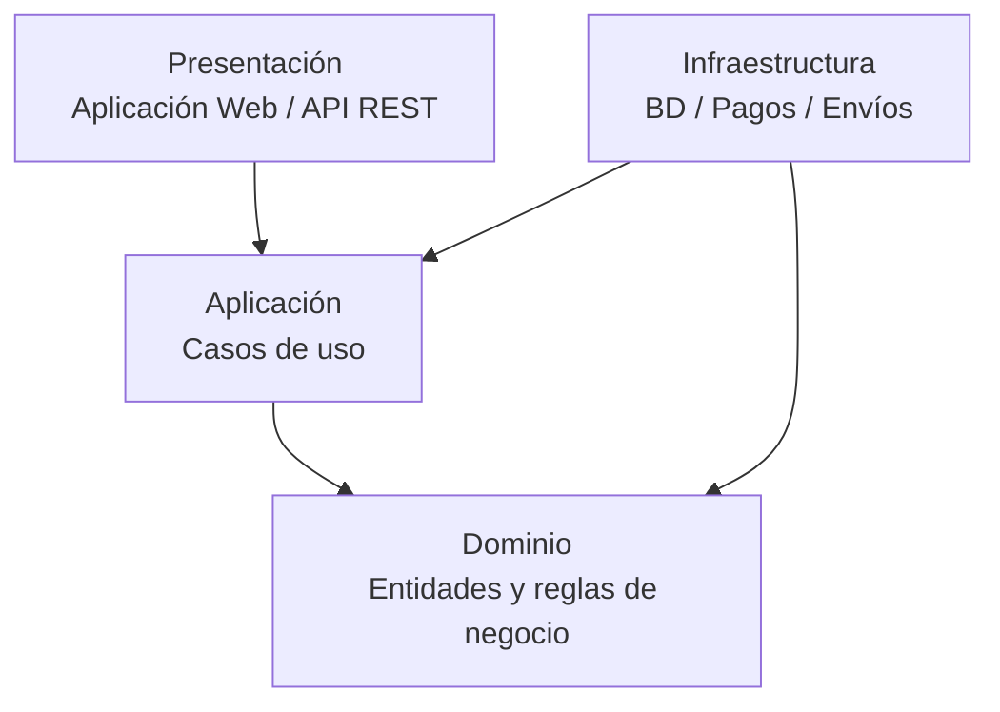

# Enfoque arquitectónico

## Clean Architecture

Para organizar las responsabilidades internas del Marketplace se aplicará el enfoque de **Clean Architecture**.

Su objetivo es separar las reglas del negocio de los detalles tecnológicos y controlar las dependencias entre las diferentes capas del sistema.

## Capas

| Capa | Responsabilidad |
|---|---|
| Dominio | Contiene las entidades y reglas principales del negocio. |
| Aplicación | Contiene los casos de uso y coordina las operaciones del sistema. |
| Infraestructura | Implementa el acceso a datos y la comunicación con servicios externos. |
| Presentación | Permite la interacción de los usuarios con el sistema mediante la aplicación web y la API. |

## Ejemplo aplicado al Marketplace

### Dominio

- Producto
- Usuario
- Seller
- Carrito
- Pedido

### Aplicación

- Listar productos
- Agregar producto al carrito
- Registrar pedido
- Procesar compra
- Gestionar productos

### Infraestructura

- Base de datos
- Repositorios
- Cliente de pasarela de pago
- Cliente de servicio de envío

### Presentación

- Aplicación web
- API REST
- Interfaces para Cliente, Seller y Administrador

## Dependencias

Las dependencias deben dirigirse hacia las capas internas.

La capa de Dominio contiene las reglas principales del negocio y no debe depender de la interfaz de usuario, base de datos o servicios externos.

## Diagrama

## Beneficios

- Separa las responsabilidades del sistema.
- Reduce el acoplamiento entre las reglas del negocio y las tecnologías externas.
- Facilita las pruebas.
- Facilita el mantenimiento y evolución del sistema.
- Permite reemplazar tecnologías externas con menor impacto en el núcleo del negocio.
