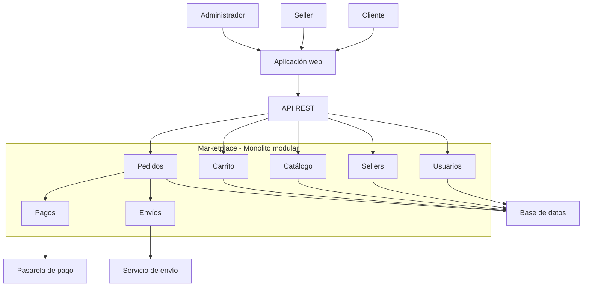

# Estilo arquitectónico

## Estilo seleccionado

Para el Marketplace se propone un estilo de **monolito modular**, donde las funcionalidades principales se organizan en módulos independientes dentro de una misma aplicación.

Esta decisión permite mantener una estructura sencilla de despliegue y, al mismo tiempo, separar las responsabilidades de cada módulo.

## Módulos principales

- Usuarios
- Sellers
- Catálogo
- Carrito
- Pedidos
- Pagos
- Envíos

## Sistemas externos

El sistema se integra con:

- Pasarela de pago.
- Servicio de envío.

## Diagrama de arquitectura

## Justificación

El monolito modular permite organizar las funcionalidades del Marketplace en módulos separados sin aumentar innecesariamente la complejidad del despliegue.

Además, esta organización facilita la evolución del sistema y permite que los módulos puedan modificarse con menor impacto sobre el resto de funcionalidades.
